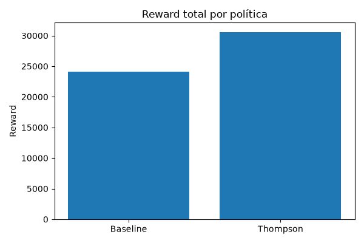
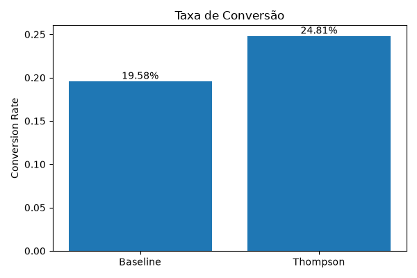
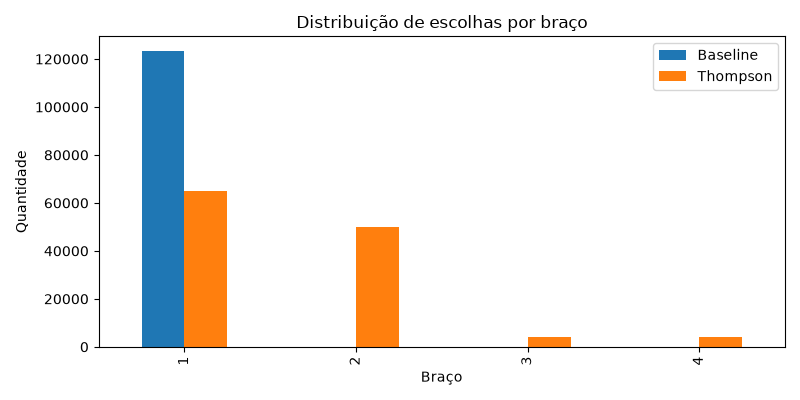

## Visão do problema
Uma instituição financeira digital precisa decidir qual abordagem de comunicação utilizar para cada cliente ao apresentar uma oferta de CDB, o objetivo é o cliente clicar na mensagem mostrando interesse pelo produto.<br><br>
Ao invés de utilizar regras fixas e testes A/B longos que demoram para reagir a mudanças, o projeto utiliza uma abordagem adaptativa de multi-armed bandit com o algoritmo Contextual Thompson Sampling para identificar comportamentos distintos, equilibrar exploração e explotação e aprender com respostas observadas sem congelar a decisão em regras estáticas.

## Instruções de execução

### 1. Clonar o repositório
```bash
git clone <url-do-repositorio>
cd datathon-7mlet-grupo-12
```

### 2. Criar e ativar o ambiente virtual
```bash
python -m venv .venv
source .venv/bin/activate
```

### 3. Instalar dependências
```bash
pip install -r requirements.txt
```

### 4. Executar o pré-processamento (opcional)

Caso seja necessário recriar a base tratada, execute:

```bash
python -m src.data.preprocessing
```

Esse script gera a tabela processada utilizada nas etapas seguintes.

### 5. Gerar os dados sintéticos (opcional)

Caso seja necessário recriar os dados sintéticos, execute:

```bash
python -m src.data.synthetic_generation
```

Serão gerados os seguintes arquivos:

- `offer_catalog.sample.csv`
- `offer_events.sample.csv`

### 6. Executar a avaliação das políticas

```bash
python -m src.evaluation.evaluation
```

Esse script:

- executa a política Baseline;
- executa a política Contextual Thompson Sampling;
- calcula as métricas de avaliação;
- gera os gráficos da comparação entre as políticas;
- registra parâmetros, métricas e artefatos utilizando o MLflow.

Os gráficos gerados serão salvos na pasta:

```text
outputs/
```

### 7. Visualizar os experimentos no MLflow

Após executar a avaliação, inicie a interface do MLflow:

```bash
mlflow ui --backend-store-uri sqlite:///mlflow.db
```

A interface estará disponível em:

```text
http://127.0.0.1:5000
```

### 8. Executar a API

```bash
uvicorn src.app:app --reload
```

A aplicação ficará disponível em:

```text
http://127.0.0.1:8000
```

A interface permite informar o contexto do cliente (idade, cargo, escolaridade e resultado da campanha anterior) e obter a oferta recomendada pelo algoritmo **Contextual Thompson Sampling**.


> **Observação**
> Os arquivos sintéticos já estão disponíveis no repositório. Dessa forma, as etapas de pré-processamento e geração sintética são opcionais e devem ser executadas apenas caso seja necessário recriar os dados.

## Estrutura do projeto

```text
.
├── data
│   ├── kaggle
│   ├── processed
│   └── synthetic_enrichment
├── notebooks
├── outputs
├── src
│   ├── data
│   ├── evaluation
│   ├── policies
│   └── app.py
├── README.md
└── requirements.txt
```

## Dados utilizados

**Dataset** - Bank Marketing<br>
**Autor** - Henrique Yamahata<br>
**Link da base Kaggle** - https://www.kaggle.com/datasets/henriqueyamahata/bank-marketing<br>
Utilizado o arquivo `bank-additional-full.csv` em `\dat\kaggle\selected-dataset.csv`<br>
**Contexto** - O conjunto de dados reúne informações de campanhas de marketing realizadas por telefone por uma instituição bancária portuguesa.

## Dicionário de dados

Colunas mantidas:<br>
- **age** 
- **job** 
- **marital** 
- **education** 
- **previous** (quantidade de contatos realizados previamente) - Apresenta relação positiva relevante com a taxa de conversão.Quanto maior o número de contatos anteriores, maior tende a ser a conversão. 
- **poutcome** (resultado da campanha anterior) - Apresenta relação positiva relevante com a taxa de conversão. Clientes com histórico positivo de campanhas anteriores apresentaram taxa de conversão superior a 60%.
- **y** - Variável alvo indicando aceitação ("yes") ou rejeição ("no") da oferta.  

Colunas acresentadas:<br>
- **customer_id** - Identificador sintético criado para relacionar clientes aos eventos simulados.

Colunas descartadas:<br>
- **default** (indica inadimplência) - Apenas 3 registros com valor "yes", sem representatividade estatística.
- **housing** (possui financiamento imobiliário) - As taxas de conversão observadas entre as categorias apresentaram diferenças pouco significativas.
- **loan** (empréstimo pessoal) - As taxas de conversão observadas entre as categorias apresentaram diferenças pouco significativas. 
- **contact** (meio de contato) - Informação específica da campanha original, não se aplica ao contexto dessa análise. 
- **month** (mês do contato) - Informação específica da campanha original, não se aplica ao contexto dessa análise. 
- **day_of_week** (dia da semana do contato) - Informação específica da campanha original, não se aplica ao contexto dessa análise. 
- **duration** (duração da ligação) - Informação conhecida somente após o contato, caracterizando vazamento temporal. 
- **campaign** (quantidade de contatos realizados na campanha) - Informação específica da campanha original, não se aplica ao contexto dessa análise.
- **pdays** (dias desde o último contato) - Informação específica da campanha original, não se aplica ao contexto dessa análise.

## Enriquecimento sintético

Como o dataset **Bank Marketing** contém apenas informações sobre clientes e o resultado de uma campanha específica de marketing bancário, foi construída uma camada de enriquecimento sintético composta por braços (ofertas), eventos de decisão e recompensas.

A simulação foi feita utilizando os seguintes critérios:

- Cada cliente recebe entre 1 e 5 ofertas, totalizando 123.519 eventos simulados para 41.176 clientes, com média aproximada de 3 eventos por cliente. 
- Os eventos são distribuídos ao longo de um horizonte de 30 dias, permitindo ao algoritmo observar múltiplas interações para um mesmo cliente.
- É utilizada uma semente fixa, que garante reprodutibilidade dos experimentos e consistência entre diferentes execuções.
- A recompensa é binária:
    - 0 → cliente não interagiu com a oferta.
    - 1 → cliente interagiu com a oferta.
- Os eventos são criados a partir das seguintes hipóteses:
    - Clientes mais jovens ou estudantes tendem a responder melhor a mensagens descontraídas.
    - Clientes com ensino superior e cargos administrativos ou de gestão tendem a responder melhor a comunicações formais.
    - Clientes com menor nível de escolaridade tendem a responder melhor a mensagens educativas.
    - Clientes com histórico positivo em campanhas anteriores apresentam maior probabilidade de responder positivamente a mensagens que enfatizam benefícios.

Essas hipóteses são utilizadas exclusivamente para construir o ambiente sintético. O algoritmo não possui acesso a essas regras e deve aprendê-las apenas por meio das recompensas observadas.

Ao todo o projeto possui as seguintes bases:
- Dataset original inalterado - data\kaggle\selected-dataset.csv
- Base processada mantendo apenas as colunas necessárias - data\processes\modeling_table.parquet
- Catálogo das ofertas com diferentes abordagens de comunicação - data\synthetic_enrichment\offer_catalog.sample.csv
- Simulação de eventos contendo cliente, braço, recompensa e datas simuladas - data\synthetic_enrichment\offer_events.sample.csv

## Comparação entre políticas

Foi realizada uma comparação entre a **Política Determinística Baseline** e o algoritmo **Contextual Thompson Sampling** utilizando os eventos sintéticos gerados.

A política Baseline sempre recomenda o mesmo braço, escolhido com base no melhor desempenho histórico global. Já o Contextual Thompson Sampling aprende, ao longo das interações, qual oferta apresenta maior probabilidade de conversão para cada contexto de cliente.

As seguintes métricas foram avaliadas:

- **Total de eventos** - quantidade total de interações simuladas. Cada um dos 41.176 clientes recebeu entre 1 e 5 ofertas, totalizando 123.288 eventos.
- **Reward** - quantidade total de recompensas obtidas por cada política, ou seja, o número de conversões realizadas.
- **Conversion Rate** - percentual de ofertas que resultaram em conversão. Enquanto a Baseline converte aproximadamente 20 a cada 100 ofertas, o Contextual Thompson Sampling converte cerca de 25 a cada 100 ofertas.
- **Exploration Rate** - percentual de braços utilizados por cada política. A Baseline explora apenas o braço considerado globalmente mais eficiente, enquanto o Contextual Thompson Sampling explora todos os braços durante o processo de aprendizagem.

> **Resultado**
> O Contextual Thompson Sampling apresentou desempenho superior à política Baseline, obtendo aproximadamente **27% mais conversões** (30.586 contra 24.139), além de uma taxa de conversão cerca de 5 pontos percentuais maior.

### Reward



### Taxa de Conversão



### Distribuição dos Braços



## Testes com Golden Set

Foi construído um Golden Set simplificado contendo cinco clientes com contextos previamente definidos.

Cada caso de teste possui:

- contexto do cliente;
- oferta esperada;
- justificativa da recomendação;
- critério de aprovação (PASS/FAIL).

O objetivo é validar se a política **Contextual Thompson Sampling** realiza recomendações coerentes com as regras de negócio estabelecidas.

Nos testes realizados, o algoritmo recomendou corretamente a oferta esperada em 4 dos 5 casos (80%), demonstrando que a política implementada foi capaz de identificar adequadamente a estratégia de comunicação esperada para a maioria dos contextos definidos.

## Arquitetura-alvo em nuvem AWS

A arquitetura proposta na AWS para implantação do projeto envolveria os seguintes serviços:<br>
- **Amazon EC2** - a API desenvolvida em FastAPI seria hospedada em uma instância EC2.<br>
- **Amazon S3** - Os arquivos utilizados pela aplicação, como o catálogo de ofertas, os eventos sintéticos e o Golden Set, seriam armazenados em um bucket S3, permitindo que a API carregue essas informações de forma centralizada e independente do código da aplicação.<br>
- **Amazon CloudWatch** - Para monitorar o funcionamento da solução, registrar logs, acompanhar métricas de utilização e identificar possíveis falhas na API.

Essa arquitetura é simples, inicialmente de baixo custo e permite evoluções futuras, como substituição dos arquivos CSV por um banco de dados ou implantação da aplicação em containers.


